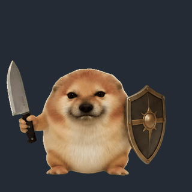
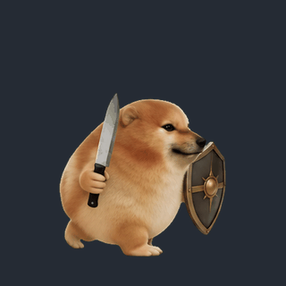
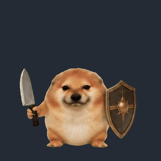
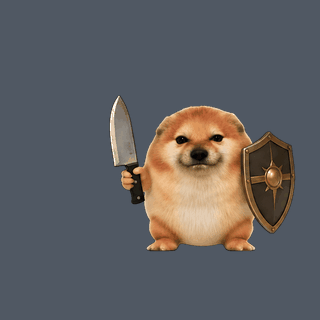
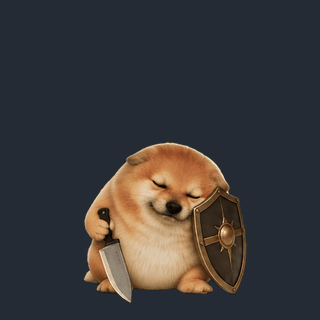
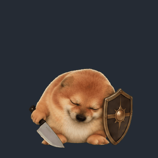
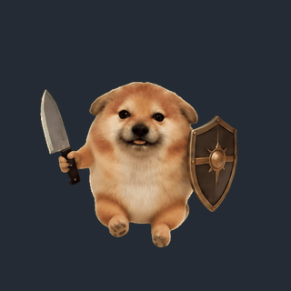
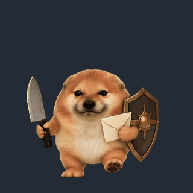
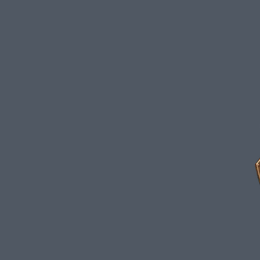
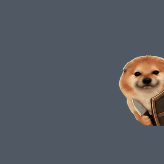

# Sword & Shield Pup

[简体中文](README.md)

An appearance plugin for Tulibang with a preview panel and local pet animation controls. Applying it keeps your companion's name, personality, and memories.

This source is the **0.4.0 candidate, not a published release**. It adds peek, unpeek, and edge rest for 11 animation states. The public 0.3.1 remains available; changing candidate source does not update the marketplace or existing Release archives.

Requires **a compatible Tulibang 0.23.0 or later test build**, with SDK `apiVersion: 1`. The host is currently available through invited testing channels. This repository distributes only the plugin.

## Use

1. Install “刀盾小狗” from the host's plugin market, or manually install `plugin.zip` from this repository's Releases.
2. Open the plugin panel and select an animation to preview. Installation and previewing do not apply the appearance automatically.
3. Choose “使用这个形象” to apply it. The appearance remains after closing the panel or restarting. “恢复原外观” restores the appearance currently owned by this plugin.
4. Select a pet animation and choose “让伙伴做动作”. Stop a loop with “回到待机”. A successful request means dispatch was accepted, not that playback finished. These controls do not control remote visitors.

Disabling or removing the active asset plugin restores the original companion appearance. If another appearance has since been applied, this plugin does not undo that later choice. The plugin ID remains `sword-shield-pilot` for upgrade continuity with earlier trial versions using the same ID.

## The candidate's 11 animation states

There are 87 transparent RGBA8 PNG frames. The original eight actions retain all 62 frames at 512 × 512, together with the icon, byte for byte. Peek and unpeek add 12 frames each, with one edge-rest frame. The new states share a 288 × 288 canvas. The build enforces the existing total limits of 8 MiB of frame data and 32 Mi decoded pixels.

| Animation | Frames | FPS | Pet playback |
| --- | ---: | ---: | --- |
| Idle `idle` | 12 | 8 | Loop |
| Walk `walk` | 12 | 12.5 | Loop |
| Greet `greet` | 6 | 6 | Once |
| Speak `speak` | 6 | 6 | Loop |
| Sleep `sleep` | 6 | 3 | Loop |
| Wake `wake` | 6 | 5.25 | Once |
| Held `drag` | 6 | 5.25 | Loop |
| Carry `send` | 8 | 9 | Loop |
| Peek `peek` | 12 | 12 | Once |
| Unpeek `unpeek` | 12 | 15 | Once |
| Edge rest `edgehide` | 1 | 1 | Hold |

The previews below and in the panel loop for inspection; greet, wake, peek, and unpeek play once on the desktop. The final peek frame, edge-rest frame, and first unpeek frame are identical for a continuous join. Carry shows stepping in place with an item. Actual movement, screen-edge behavior, and visits belong to the host. Some visual differences remain between animations, and the six-frame actions have limited smoothness.

On host 0.23.1, docking the local pet plays peek and holds, while a visitor leaving the screen edge plays unpeek. Dragging the local pet away uses the existing drag action and does not automatically play unpeek. Both clips can also be played manually from the plugin panel.

| Idle | Walk |
| --- | --- |
|  |  |
| Greet | Speak |
|  |  |
| Sleep | Wake |
|  |  |
| Held | Carry |
|  |  |
| Peek (candidate) | Unpeek (candidate) |
|  |  |

## Permissions and data

| Permission | Purpose |
| --- | --- |
| `ui` | Open and close the appearance preview panel. |
| `appearance` | Query appearances, apply this plugin's own assets, and restore its currently applied appearance. |
| `pet` | Query the current companion's available animations and request local playback. |

The plugin requests no Node access, has no background tool entry, makes no external network requests, and collects no account, chat, file, or clipboard data. Build scripts run only during development and CI and are excluded from the installation archive.

Compatible hosts handle visitor asset transfer using validated PNG files and animation metadata. The receiving host does not execute this plugin's panel code. Both hosts must support the relevant transfer protocol; preparation failure makes the host cancel departure and report the failure.

## Build and verify

Requires only the Python 3.9+ standard library, with no third-party dependencies:

```sh
python3 -m unittest discover -s tests -p 'test_*.py' -v
python3 scripts/build.py
```

Named commands are also available: `npm run test:delivery`, `npm run check:public`, and `npm run build`. Outputs are `dist/plugin.zip` and `dist/plugin.zip.sha256`. See [build and release details](docs/BUILD.md). CI packaging checks do not replace real installation, application, and restoration tests in a compatible host.

## Provenance and license

The character references [Bilibili video BV1A8w7zCEwm](https://www.bilibili.com/video/BV1A8w7zCEwm/), and the animation assets include AI-derived imagery. MIT applies to code only. Images are excluded, with no claim of wholly original authorship or unrestricted commercial rights. See [image provenance and rights](ASSETS.md) and the [code license](LICENSE).
